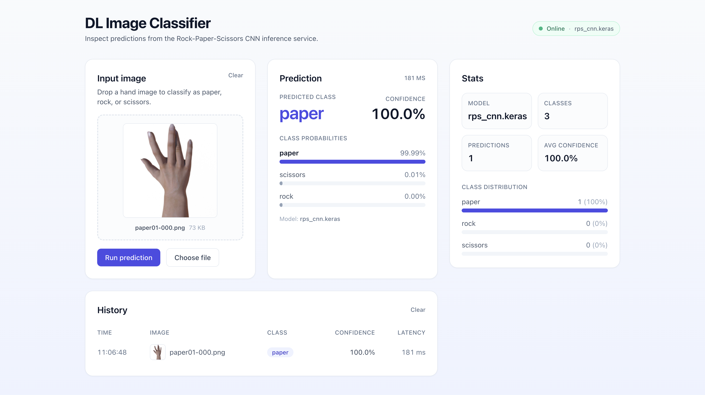

# Deep Learning Image Classifier

An end-to-end deep learning system that trains a convolutional neural network on the
Rock-Paper-Scissors dataset, serves it behind a FastAPI inference API, and exposes a
Next.js dashboard for interactive use and inspection.

The project is organised as three independent but composable workspaces:

- **`ai/`**  - research, training, and model artifact production (Keras / TensorFlow).
- **`backend/`** - production-grade FastAPI inference service that loads the trained model.
- **`frontend/`** - Next.js 14 dashboard that consumes the API and visualises predictions.



---

## Table of contents

1. [Architecture](#architecture)
2. [Repository layout](#repository-layout)
3. [Quick start](#quick-start)
4. [The `ai/` workspace - training](#the-ai-workspace---training)
5. [The `backend/` workspace - inference API](#the-backend-workspace---inference-api)
6. [The `frontend/` workspace - dashboard](#the-frontend-workspace---dashboard)
7. [End-to-end workflow](#end-to-end-workflow)
8. [Configuration reference](#configuration-reference)
9. [Testing](#testing)
10. [Docker](#docker)
11. [Design system](#design-system)
12. [Roadmap](#roadmap)

---

## Architecture

```
+--------------------+         +-------------------------+         +------------------------+
|        ai/         |         |        backend/         |         |       frontend/        |
|--------------------|         |-------------------------|         |------------------------|
| Notebooks          |  .keras | FastAPI + Pydantic      |  HTTPS  | Next.js 14 (App Router)|
| Keras CNN training | ------> | Keras predictor         | <-----> | React 18 + TypeScript  |
| Dataset pipeline   |         | /api/v1/health          |         | Tailwind CSS 3         |
| Evaluation         |         | /api/v1/predict         |         | Drag-and-drop UI       |
+--------------------+         +-------------------------+         +------------------------+
```

The contract between layers is intentionally narrow:

- `ai/` produces a single artifact: `rps_cnn.keras` (a 150x150x3 -> 3-class model).
- `backend/` loads that artifact, validates uploads, and returns a typed JSON response.
- `frontend/` only knows two endpoints (`/health`, `/predict`) and renders state.

This separation lets each workspace evolve on its own cadence and be deployed independently.

---

## Repository layout

```
dl-project/
├── ai/                     Training code and notebooks
│   ├── notebooks/          Exploratory and final training notebooks
│   │   ├── rock_paper_scissors_cnn.ipynb
│   │   ├── dl-v1.ipynb / dl-v2.ipynb / dl-v3.ipynb
│   │   ├── 1-yolo-v0.ipynb ... 5-yolo_object-detection.ipynb
│   │   ├── rps_dataset/    Train / validation imagery
│   │   └── rps_cnn.keras   Latest exported model
│   └── src/                Importable training utilities
│
├── backend/                FastAPI inference service
│   ├── app/
│   │   ├── main.py         App factory, lifespan, CORS
│   │   ├── core/config.py  Pydantic settings (APP_* env vars)
│   │   ├── schemas/        Request / response models
│   │   ├── inference/      Predictor base + Keras implementation
│   │   ├── services/       Wires settings into a predictor
│   │   └── api/routes/     /health and /predict routers
│   ├── artifacts/rps_cnn.keras
│   ├── tests/              pytest suite (health + predict)
│   ├── Dockerfile
│   └── requirements.txt
│
├── frontend/               Next.js dashboard
│   ├── src/
│   │   ├── app/            layout.tsx, page.tsx, globals.css
│   │   ├── components/     Card, HealthBadge, PredictionForm,
│   │   │                   PredictionResult, PredictionHistory, StatsPanel
│   │   ├── hooks/          useHealth (10s polling)
│   │   └── lib/            api client, types, formatters
│   ├── tailwind.config.ts
│   └── package.json
│
├── docs/                   Documentation assets (screenshots, diagrams)
├── DESIGN.md               UX and visual system spec for the frontend
├── docker-compose.yml      Multi-service composition (optional)
├── Makefile                Convenience targets
├── pyproject.toml          Python project metadata (uv-managed)
└── README.md               You are here
```

---

## Quick start

Prerequisites: **Python 3.11+** with [`uv`](https://docs.astral.sh/uv/), **Node.js 18.17+**, and **npm**.

```bash
# 1. Install Python dependencies (creates .venv via uv)
uv sync

# 2. Start the FastAPI inference server
cd backend
uv run fastapi dev app/main.py
# -> http://localhost:8000  (OpenAPI UI at /docs)

# 3. In a second terminal, start the dashboard
cd frontend
npm install
cp .env.local.example .env.local
npm run dev
# -> http://localhost:3000
```

The dashboard polls `/api/v1/health` every 10 seconds; when the badge turns green you
can drop an image to classify it as `paper`, `rock`, or `scissors`.

---

## The `ai/` workspace - training

The `ai/` workspace is where the model is conceived, trained, and evaluated. Two
modelling tracks live side by side:

- **Rock-Paper-Scissors CNN** (the production model). A compact Keras Sequential CNN
  trained on `ai/notebooks/rps_dataset/`, exported as `rps_cnn.keras` (150x150x3 input,
  3-class softmax output). See `ai/notebooks/rock_paper_scissors_cnn.ipynb` and the
  iterative `dl-v{1,2,3}.ipynb` notebooks.
- **YOLO experiments** (research only). The `1-yolo-*` through `5-yolo-*` notebooks
  benchmark Ultralytics YOLO classification and detection on the same imagery for
  comparison. These are not deployed.

### Training a fresh model

Open the relevant notebook (Jupyter or VS Code) and run it top to bottom. The pipeline
is conventional:

1. Load and stratify-split `rps_dataset/` with Keras image utilities.
2. Augment with random flips, rotations, and zooms.
3. Train the CNN (Adam optimiser, sparse categorical cross-entropy).
4. Evaluate on the held-out split (accuracy, confusion matrix).
5. Export to `rps_cnn.keras`.

### Promoting a model to the backend

Copy the exported artifact into the location the backend expects:

```bash
cp ai/notebooks/rps_cnn.keras backend/artifacts/rps_cnn.keras
```

Restart the backend to pick up the new weights. The class order
(`paper, rock, scissors`) must match `APP_CLASS_NAMES`.

---

## The `backend/` workspace - inference API

A small, strict FastAPI service. Settings are environment-driven (`APP_*`), the model
is warmed up during the application lifespan, and uploads are validated on size and
content type before they reach Keras.

### Endpoints

| Method | Path                | Purpose                          |
| ------ | ------------------- | -------------------------------- |
| GET    | `/api/v1/health`    | Liveness, model name, class list |
| POST   | `/api/v1/predict`   | Multipart image -> prediction    |
| GET    | `/`                 | Service banner                   |
| GET    | `/docs`             | OpenAPI UI                       |

### Sample request

```bash
curl -F "file=@ai/notebooks/paper01-000.png" \
     http://localhost:8000/api/v1/predict
```

```json
{
  "label": "paper",
  "confidence": 0.997,
  "probabilities": [
    {"label": "paper",    "probability": 0.997},
    {"label": "rock",     "probability": 0.002},
    {"label": "scissors", "probability": 0.001}
  ],
  "model_name": "rps_cnn.keras",
  "inference_ms": 24.7
}
```

### Run locally

```bash
cd backend
uv run fastapi dev app/main.py
```

See [`backend/README.md`](backend/README.md) for the complete reference.

---

## The `frontend/` workspace - dashboard

A Next.js 14 (App Router) single-page dashboard that treats prediction as a
diagnostic conversation: input on the left, result in the middle of the user's gaze,
history below, and stats in the periphery.

Component map:

| Component            | Responsibility                                                    |
| -------------------- | ----------------------------------------------------------------- |
| `HealthBadge`        | Polls `/health` every 10 s, surfaces online / degraded / offline. |
| `PredictionForm`     | Drag-and-drop image input with preview and validation.            |
| `PredictionResult`   | Hero label, confidence, and animated probability bars.            |
| `PredictionHistory`  | Tabular log of the last 20 predictions with thumbnails.           |
| `StatsPanel`         | 2x2 facts grid plus class-distribution chart.                     |

### Run locally

```bash
cd frontend
npm install
cp .env.local.example .env.local   # set NEXT_PUBLIC_API_BASE_URL if non-default
npm run dev
```

See [`frontend/README.md`](frontend/README.md) for the complete reference, and
[`DESIGN.md`](DESIGN.md) for the visual and interaction system the UI implements.

---

## End-to-end workflow

```
  ai/notebooks/*.ipynb
        |
        |  train, evaluate
        v
  rps_cnn.keras
        |
        |  cp -> backend/artifacts/
        v
  backend (FastAPI)  --- /api/v1/predict (multipart) --->  Keras predictor
        ^                                                          |
        |  JSON: label, confidence, probabilities, latency         |
        |  <-------------------------------------------------------+
        |
  frontend (Next.js dashboard)
        |
        |  Drag-and-drop image  ->  POST /api/v1/predict
        |  Render hero, bars, history, stats
        v
  User sees a calibrated, latency-aware prediction
```

---

## Configuration reference

All backend settings come from environment variables prefixed with `APP_` (a `.env`
file in `backend/` is also honoured):

| Variable                | Default                                | Purpose                              |
| ----------------------- | -------------------------------------- | ------------------------------------ |
| `APP_MODEL_PATH`        | `backend/artifacts/rps_cnn.keras`      | Where to load the Keras model from   |
| `APP_IMAGE_SIZE`        | `[150, 150]`                           | Input resolution expected by the CNN |
| `APP_CLASS_NAMES`       | `["paper", "rock", "scissors"]`        | Output class order                   |
| `APP_API_PREFIX`        | `/api/v1`                              | Mount point for all routes           |
| `APP_CORS_ORIGINS`      | `["*"]`                                | CORS allow-list                      |
| `APP_MAX_UPLOAD_BYTES`  | `8388608` (8 MiB)                      | Per-request upload cap               |

The frontend reads a single environment variable:

| Variable                    | Default                          | Purpose                  |
| --------------------------- | -------------------------------- | ------------------------ |
| `NEXT_PUBLIC_API_BASE_URL`  | `http://localhost:8000/api/v1`   | Base URL for API calls   |

---

## Testing

```bash
# Backend (pytest)
cd backend
uv run pytest

# Frontend (type-checking and lint)
cd frontend
npm run typecheck
npm run lint
```

The backend test suite covers both `/health` and `/predict`, including upload
validation and the 503-when-model-missing path. See `backend/tests/`.

---

## Docker

The backend ships with a self-contained Dockerfile:

```bash
docker build -t dl-backend ./backend
docker run --rm -p 8000:8000 dl-backend
```

A `docker-compose.yml` placeholder lives at the repository root for future
multi-service composition (backend + frontend behind a reverse proxy).

---

## Design system

The frontend's visual language - palette, typography, layout, motion, accessibility,
and state design - is documented in [`DESIGN.md`](DESIGN.md). Highlights:

- Restrained two-tone palette: **indigo** for action, **slate** for structure.
- `rounded-2xl` cards on a subtle `#f8fafc -> #eef2ff` gradient backdrop.
- Probability bars animate over 500 ms; nothing animates in on first paint.
- Every async surface defines empty, loading, error, and success states.

When a pattern changes in code, change it in `DESIGN.md` in the same PR.

---

## Roadmap

Items deliberately out of scope today, but the architecture is built to absorb them:

- **Batch prediction.** Add a `predict_batch` endpoint and a sibling tab in
  `PredictionForm` that drops a CSV or zip of images.
- **Model versioning.** Surface a model selector in `StatsPanel` once the backend
  serves more than one artifact.
- **Persistent history.** Promote the in-memory history store to `localStorage` or
  an authenticated backend without changing the `HistoryEntry` shape.
- **Telemetry.** Latency per prediction is already computed; surface a rolling
  p50 / p95 in `StatsPanel`.
- **Dark mode.** Tokens are already in place; add a `dark:` variant set and re-check
  contrast.

---

## License

Internal project. All rights reserved by the authors.
